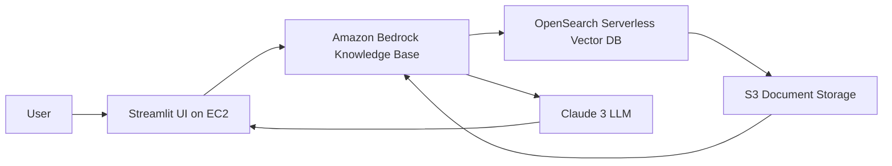

# Enterprise RAG Q&A System with Amazon Bedrock Knowledge Bases
A production-ready **Retrieval-Augmented Generation (RAG)** Question-Answering application that enables employees to ask natural language questions about proprietary company documents and receive **accurate, citation-backed responses**.
Built using **Amazon Bedrock Knowledge Bases**, this solution eliminates hallucinations by grounding LLM outputs in private enterprise data.

## Overview
Traditional enterprise search tools often fail because they:
* Require exact keyword matches
* Return irrelevant results
* Lack natural language understanding
Meanwhile, standalone LLMs hallucinate when asked about internal company documents not included in their training data.

### Solution: Retrieval-Augmented Generation (RAG)
This system combines:
1. **Semantic retrieval** from your internal knowledge base
2. **LLM reasoning** using retrieved context
3. **Citation-backed answers** for trust and transparency

## Key Features
* **Semantic Search** – Retrieve documents by meaning, not just keywords
* **Citation-backed Responses** – Every answer includes document references
* **Managed RAG Pipeline** – Amazon Bedrock handles embeddings, chunking, and retrieval
* **Streamlit Frontend** – Modern chat-based UI with streaming responses
* **AWS-native Security** – IAM-based fine-grained access control
* **Scalable Deployment** – Production-ready on EC2

## Architecture



## System Workflow
1. User submits a question via Streamlit UI
2. Query is converted into embeddings
3. Vector similarity search retrieves relevant chunks from OpenSearch
4. Retrieved context is passed to Claude 3
5. Claude generates grounded answer with citations
6. Response is returned to user

## Repository Structure

```bash
.
├── app.py
├── requirements.txt
├── README.md
│
├── deploy/
│   ├── ec2-setup.sh
│   └── streamlit.service
│
├── scripts/
│   ├── create_kb.py
│   ├── ingest_docs.py
│   └── query_test.py
│
└── docs/
    └── setup-guide.md
```

---

## Prerequisites
Before getting started, ensure you have:
* AWS Account with Amazon Bedrock access
* Claude 3 + Titan Embeddings model access enabled
* AWS CLI configured
* Python 3.9+
* Internal company documents in supported format:
Supported formats:
* PDF
* TXT
* DOCX
* HTML
* Markdown
* CSV

## Quick Start
### Step 1: Upload Documents to S3
```bash
aws s3 cp ./company-docs/ s3://your-kb-bucket/documents/ --recursive
```


### Step 2: Create Knowledge Base
```bash
python scripts/create_kb.py \
    --name "my-company-kb" \
    --bucket "your-kb-bucket" \
    --role-arn "arn:aws:iam::ACCOUNT:role/BedrockKB-Role"
```

#### Recommended Configuration

| Parameter       | Value                        |
| --------------- | ---------------------------- |
| Embedding Model | amazon.titan-embed-text-v2:0 |
| Vector Store    | OpenSearch Serverless        |
| Chunk Size      | 300 Tokens                   |
| Overlap         | 20%                          |


### Step 3: Ingest Documents
```bash
python scripts/ingest_docs.py --knowledge-base-id YOUR_KB_ID
```
Wait until ingestion completes in AWS Console.

### Step 4: Run Locally

```bash
pip install -r requirements.txt
streamlit run app.py
```

---

### Step 5: Deploy to EC2

```bash
chmod +x deploy/ec2-setup.sh
./deploy/ec2-setup.sh
```

Application will be available at:

```bash
http://YOUR_EC2_IP:8501
```


## IAM Permissions
### EC2 Instance Role Policy
```json
{
  "Version": "2012-10-17",
  "Statement": [
    {
      "Effect": "Allow",
      "Action": [
        "bedrock:RetrieveAndGenerate",
        "bedrock:Retrieve",
        "bedrock:InvokeModel"
      ],
      "Resource": "arn:aws:bedrock:*:*:knowledge-base/YOUR_KB_ID"
    },
    {
      "Effect": "Allow",
      "Action": "s3:GetObject",
      "Resource": "arn:aws:s3:::your-kb-bucket/*"
    }
  ]
}
```

> **Security Note:** Never use wildcard `*` permissions in production.
## Advanced Features
### Metadata Filtering
```python
retrieval_config = {
    "vectorSearchConfiguration": {
        "numberOfResults": 5,
        "filter": {
            "equals": {
                "key": "department",
                "value": "engineering"
            }
        }
    }
}
```

### Streaming Responses

```python
response = bedrock_runtime.retrieve_and_generate_stream(
    input={"text": prompt},
    retrieveAndGenerateConfiguration={...}
)

for event in response['stream']:
    if 'output' in event:
        yield event['output']['text']
```


### Feedback Logging

```python
def log_feedback(query, response, helpful, comment):
    pass
```


## Monitoring & Observability
Recommended AWS monitoring stack:
* **CloudWatch Metrics** – Track latency and failures
* **CloudTrail** – Audit Bedrock API calls
* **Custom Logging** – Store query/response history
Example logging:

```python
import logging

logging.basicConfig(level=logging.INFO)

logger = logging.getLogger(__name__)

logger.info(f"Query: {query} | Citations: {citations}")
```

## Cost Optimization

| Component         | Optimization                    |
| ----------------- | ------------------------------- |
| LLM Inference     | Use Claude Haiku for simple Q&A |
| Complex Reasoning | Use Claude Sonnet               |
| Embeddings        | Titan costs ~$0.02 / 1M tokens  |
| EC2               | Start with t3.micro             |
| Scaling           | Upgrade to t3.medium+           |

### Estimated Monthly Cost
**~$1.50 for 1,000 queries/month**

## Testing
Run retrieval tests via CLI:

```bash
python scripts/query_test.py \
    --kb-id YOUR_KB_ID \
    --question "What is our remote work policy?"
```

Example Output:

```bash
Answer:
The company allows remote work up to 3 days per week...

Sources:
- policies/remote-work.pdf (page 4)
- employee-handbook.docx (section 3.2)
```
## Troubleshooting
| Issue                 | Solution                             |
| --------------------- | ------------------------------------ |
| AccessDeniedException | Verify IAM permissions               |
| No Results            | Confirm ingestion completed          |
| Hallucinations        | Reduce retrieved chunk count         |
| High Latency          | Enable streaming / reduce chunk size |

## Continuous Improvement Strategy
To maximize system quality:
1. Monitor unanswered queries
2. Remove outdated documents
3. Compare Claude Haiku vs Sonnet
4. Collect user feedback

## Future Enhancements
Planned roadmap:
* [ ] Add Cognito/OAuth Authentication
* [ ] Terraform Deployment Templates
* [ ] Slack Bot Integration
* [ ] Semantic Query Caching
* [ ] Multi-tenant Support

## Contributing
Contributions are welcome.
1. Fork repository
2. Create feature branch
3. Submit pull request

## License
Licensed under the **MIT License**.

## Acknowledgements
Special thanks to:
* AWS Bedrock 
* Streamlit

## Final Note
> Empower your enterprise with intelligent document search and grounded AI responses.
> No more digging through PDFs—just ask questions and get instant answers.
